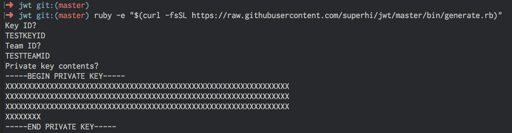

# SuperHi trying to make Apple's JSON Web Token system a little bit easier...

This is a small command line tool used to generate a JSON Web Token (JWT) as seen on [jwt.io](https://www.jwt.io). Apple use these for their new MapKit.js tool.

This tool will give you a long-lasting token. Only use this if you're pretty sure no large sites are going to be stealing your tokens regularly otherwise you might hit your account limits. It's a good idea for security reasons to change the token regularly. It is also possible to use the code in here to make an automatic token generator too. Just read through the bin/generate.rb file for more info.

## To use this tool

Sign up or login to [Apple Developer Portal](https://developer.apple.com). 

For MapKit.js, go to Maps IDs and generate a new Maps ID using the plus icon. Next, go to Keys > All and generate a new key with the MapKit JS checkbox checked.

Using your Apple Team ID ([as seen on here](https://developer.apple.com/account/#/membership/)), the Key ID and the key certificate that's been downloaded, go to your command line and run the following...

```
sudo gem install jwt
```

You will get a password request, use your system password (it will not appear in your command line at all, just keep typing). Once the Ruby JWT libray is installed, run...

```
ruby -e "$(curl -fsSL https://raw.githubusercontent.com/superhi/jwt/master/bin/generate.rb)"
```

This will run a command that will ask for your Team ID, Key ID and the contents of your certificate (just open the certificate in a text editor and copy and paste it in). 

Something like this...



After entering all three, you should get a token to use. It will also be copied to your clipboard.

If you're curious about how the code works OR if you're worried about us stealing your secrets, please look over the files in here!